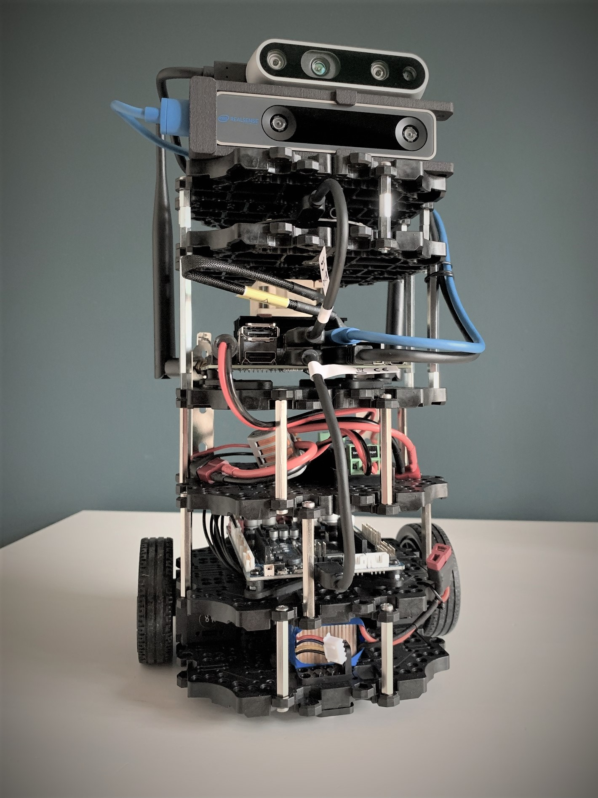

# Joeri Verbiest - PhD MSc

 

**Engineer & researcher**, +17y experience, with demonstrated history of working in research and industry, from proof of concept to product.

 

    

[Marvin](https://jrverbiest.github.io/Marvin/): AI R&D Robot platform.

 

---

## Work Experience

- **Senior researcher** @ KdG University of Applied Science and Arts - NxT Media Technology, Campus Hoboken, Antwerp, Belgium

  ° [AIoT](https://jrverbiest.github.io/AIoT/) - Artificial Intelligence of Things.

  A platform to show the potential of machine learning on embedded devices. The platform consists of the [NVIDIA® Jetson Nano™ Developer Kit](https://developer.nvidia.com/embedded/jetson-nano-developer-kit) (bottom) and the [STM32L4 Discovery kit IoT node, B-L475E-IOT01A](https://www.st.com/en/evaluation-tools/b-l475e-iot01a.html) (top).

  
    

  

  ° *Project: [Tetra project HBC.2019.2033](https://researchportal.be/en/project/effects-air-quality-theaccommodations-ships-human-health-monitoring-environmental) (1 January 2020 - 30 November 2021)*

  Effects of air quality in the accommodations of ships on human health: monitoring environmental parameters, risk analysis and recommendations (ELGAS)

  Project partners: Hogere Zeevaartschool (HZS), Karel De Grote Hogeschool (KdG) and VITO. KdG is responsible for the IoT platform (system, software and firmware design). *Project ongoing*

- **Senior Consultant** @ VeroTech, Leuven, Belgium

  - *@ Cochlear Technology Centre (CTC), Mechelen, Belgium.* 

    Tasks: a. system engineering support: PCB design, assembly and testing. b. R&D wireless power transfer. 

    Tools: SIMetrix Circuit Design and Simulation (Spice), Python and Altium Designer (PCB design)

- **Project Manager** @ Peira, Turnhout, Belgium

  Responsible for: a. formulation of technical solutions; b. communication with customers and coordination of technicians, partners, colleagues and suppliers involved in the project; c. provides input for technical specifications, requirements and documentation.

- **Senior Electronic Engineer** @ Bruker microCT & Bruker Biospin

  - *@ Bruker Biospin, Rheinstetten, Germany / Wissembourg, France / Kontich, Belgium.* 

    Project: an application in the area Electron Paramagnetic Resonance (EPR).

    Comprising: a. sub-system analog electronic design using COTS high power operational amplifier; b. PCB design (software tool: Altium Designer); c. simulation and theoretical design (software tool: TINA and LTSpice).

  - *@ Bruker micro-CT, Kontich, Belgium.* 

    Responsible for: electrical and electronic design for the optical X-ray imaging system inside the Optical Molecular Imaging (OMI) team.

    Comprising: a. architecture definition; b. (sub-)system technical requirement definition and design; c. integration and testing; d. contact person for electrical and electronic suppliers; e. stepper motor control (with encoder) using COTS (Nanotec) drivers (programming language: C and Python); f. firmware design (programming language: C and Python) microcontroller based design (Atmel) for low level control and monitoring of the instrument; g. PCB design (software tool: Altium Designer).

- **Research Engineer** @ Pepric, Leuven, Belgium

  Responsible for: technology development of an ex-vivo instrument for quantification of magnetic nanoparticles.

  Comprising: a. architecture definition and (sub-)system technical requirement definition; b. project definition and follow-up; c. contact person for solution providers and suppliers (i.e. electrical, electronic and mechanical design houses); d. hardware, software integration (C++, Matlab, Python and basic GUI design in C#); e. system test, validation and instrument control; f. RF design: surface coil design (300 MHz) mainly analytical (software tools: LTSpice and Matlab) and by experiment; g. IP generation (one patent, see publication list); h. provide input (technology, R&D, budget, roadmap, planning) for projects (IWT) and business plan (venture capital); i. member of European project [*Multifun (Multifunctional nanotechnology for selective detection and treatment of cancer)*](https://cordis.europa.eu/project/rcn/99273/factsheet/en) and co-author of several scientific publications (see publication list).

- **RF Engineer** @ Orban Microwave Products, Leuven, Belgium

  Responsible for: GaN power amplifier (using X-parameters and compact models) and active antenna design in framework of European project [*PANAMA (Power Amplifier aNd Antennas for mobile Applications)*](http://www.catrene.org/web/downloads/profiles_catrene/CA101-PANAMA-project%20profile-final%20%287-6-11%29.pdf) active in two work packages (one as work package leader).

  Used software and measurement tools: Advanced Design System, Momentum, Microwave office, EAGLE (PCB design), Vector Network Analyzer, spectrum analyzer, power meter, signal generator and oscilloscope

- **Product Generation Engineer** @ NMDG, Leuven, Belgium

  Responsible for: a. translation prototype to product; b. contact person for hardware (electronic and mechanical) suppliers and EMC/Safety test house; c. project follow-up; d. stock and order flow-up (‘procurement’); e. support in test and measurements; f. R&D (IWT O&O project, part: next generation phase reference generator).

  Used software and measurement tools: Advanced Design System, Mathematica, Vector Network Analyzer, signal and (arbitrary) waveform generator, power meter, (sampling) oscilloscope, spectrum analyzer.

- **Project: Antenna design for medical implant** @ Client ‘X’ - Katholieke Universiteit Leuven (Esat-Telemic), project under Non-Disclosure Agreement, Leuven, Belgium 

  Achievements: proof of concept and a prototype design.

  Used design software tools: CST Microwave Office, Matlab and Advanced Design System

- **Doctoral Research** @ Katholieke Universiteit Leuven (Esat-Telemic), Leuven Belgium 

  Funded by IWT PhD scholarship (active participation in drafting and preparation of the grant application) .

  Research topic: Design of antennas used on the human body. Research that focused on the design of small low cost ultra-wideband (UWB), 3.0-9.0 GHz, antennas for wireless body area networks (WBAN).

  Used design software tools: CST Microwave Office, Matlab and Advanced Design System

  Other activities: a. treasurer IEEE Student Branch Leuven (2003-2005), b. supervision study projects in the course Wireless and Mobile Communications, c. supervision of different (Master) thesis. d. author of several scientific publications (see publication list).

- **Summer job**, Clock-o-Matic, Holsbeek, Belgium

  Task: a. solves component failure by lightning (surge immunity). b. feasibility study of wireless communications inside a church (communication between electronic bell ringing systems).

 

## Education

- **Doctoral degree in Engineering Science (PhD, dr.)**, Katholieke Universiteit Leuven, Leuven, Belgium, 2007. 

  Funded by IWT PhD scholarship (active participation in drafting and preparation of the grant application)

  Thesis: Design of Antennas used on the Human Body.

- **Master of Science in Electrical Engineering (MSc, ir.)**, Cum Laude, option Telecommunication and Telematic, Katholiek Universiteit Leuven, Leuven, Belgium, 2002

  Thesis: Exposure of Human Blood to an Electromagnetic field and the numerical model.

  The numerical model (Finite-Difference Time-Domain method) was written in C on a Linux platform. 

  Extra courses in biomedical and energy engineering: Human Physiology, Biology and Biochemistry of Human Systems including Human Biotechnology, Biomedical Measurements and Stimulation, transport Phenomena in Biological systems, Finite Elements for magnetic fields and optimization.

- **Industrial Engineer Electricity (MSc, Ing.)**, Cum Laude, option Electronics specialization telecommunication, Institute for Higher Education in the Sciences & the arts, De Nayer Institute, Sint-Katelijne-Waver, Belgium, 1999

  Thesis + intership @ Hevrox EMC/Safety services, Beringen, Belgium (today Hevrox EMC/Safety Services is integrated in EMI solution).

  Thesis: Validation of a fully anechoic room according the prEN 50147-3 with HP-VEE. Content: implementation of an automatic measurement tool using HP-VEE and the validation of the fully anechoic chamber.

 

## Udacity Nanodegrees

- *[Machine Learning Engineer Nanodegree](https://jrverbiest.github.io/Udacity_Machine_Learning_Engineer_Nanodegree/)* - [Certificate](http://jrverbiest.eu/docs/Certificate%20Machine%20Learning%20Engineer%20Nanodegree.pdf)
  
  **Objectives:** Build predictive models using a variety of unsupervised and supervised machine learning techniques. Understand cloud deployment terminology and best practices. Use Amazon SageMaker to deploy machine learning models to production environments, such a sa web application or piece of hardware. A/B test two different deployed models and evaluate their performance. Utilize an API to deploy a model to a website such that it responds to user input, dynamically. Update a deployed model, in response to changes in the underlying data source.
  
  - Project 1: Machine Learning in Production. Deploy a Sentiment Analysis Model.
  
    Using SageMaker, deploy a PyTorch sentiment analysis model, which is trained to recognize the sentiment of movie reviews (positive or negative).
  
    - [Link to Project](https://github.com/JrVerbiest/Udacity_Machine_Learning_Engineer_Nanodegree/tree/master/Deployment%20Project%20Sentiment%20Analysis)
  
  - Project 2: Machine Learning Case Studies. Plagiarism Detector.
  
    Engineer features that can help identify cases of plagiarism in text and deploy a trained plagiarism detection model using Amazon SageMaker. 
  
    - [Link to Project](https://github.com/JrVerbiest/Udacity_Machine_Learning_Engineer_Nanodegree/tree/master/Plagiarism%20Detection)
  
  - Project 3: Machine Learning Capstone
  
    A final project that involves data exploration and machine learning.
    
    - [About](https://github.com/JrVerbiest/Udacity_Machine_Learning_Engineer_Nanodegree/blob/master/Capstone%20Project/README.md)
    - [Project proposal](https://github.com/JrVerbiest/Udacity_Machine_Learning_Engineer_Nanodegree/blob/master/Capstone%20Project/Proposal.pdf)
    - [Project Report](https://github.com/JrVerbiest/Udacity_Machine_Learning_Engineer_Nanodegree/blob/master/Capstone%20Project/Report.pdf)
  

- [*Data Scientist Nanodegree: Machine Learning for Data Scientists*](https://jrverbiest.github.io/Udacity_Data_Scientist_Nanodegree/)

  **Objectives:** learn the skills you need to perform well as a data scientist with a focus on machine learning (supervised, unsupervised and neural networks).

  - Project 1: Supervised Learning. Finding Donors for CharityML

    CharityML is a fictitious charity organization that provides financial support for people learning machine learning. In an effort to improve donor outreach effectiveness, an algorithm is build that best identifies potential donors. The goal will be to evaluate and optimize several different supervised learners to determine which algorithm will provide the highest donation yield.

    [Link to Project](https://github.com/JrVerbiest/Udacity_Data_Scientist_Nanodegree)

  - Project 2: Deep Learning. Create an Image Classifier

    In this project, an image classification application is implement using a deep learning model on a dataset of images and the trained model is used to classify new images. First, develop code in a Jupyter notebook using PyTorch, second convert it into a python application that you will run from the command line of your system.

    This project is the same as the final AI Programming with Python Nanodegree project.

    [Link to Project](https://github.com/JrVerbiest/Udacity_Data_Scientist_Nanodegree)

  - Project 3: Unsupervised Learning. Creating Customer Segments

    The data and design for this project is provided by Arvato Financial Services. Apply unsupervised learning techniques on demographic and spending data for a sample of German households. Preprocess the data, apply dimensionality reduction techniques, and implement clustering algorithms to segment customers with the goal of optimizing customer outreach for a mail order company.
    
    [Link to Project](https://github.com/JrVerbiest/Udacity_Data_Scientist_Nanodegree)

- [*AI Programming with Python, introduction to neural networks*](https://jrverbiest.github.io/Udacity_AI_Programming_with_Python_Nanodegree/) - [Certificate](http://www.jrverbiest.eu/docs/Certificate%20AI%20Programming%20with%20Python%20Nanodegree.pdf)

  Course content and tools: Python, NumPy, Pandas, Seaborn, PyTorch, linear algebra and deep learning.

  - Project: Image Classifier Project using PyTorch

    In this project, an image classification application is implement using a deep learning model on a dataset of images and the trained model is used to classify new images. First, develop code in a Jupyter notebook, second convert it into a python application that you will run from the command line of your system.
    
    [Link to Project](https://github.com/JrVerbiest/Udacity_AI_Programming_with_Python_Nanodegree)

- [*Introduction to Programming Nanodegree*](https://jrverbiest.github.io/Udacity_Intro_to_Programming_Nanodegree/) - [Certificate](http://www.jrverbiest.eu/docs/Certificate%20Intro%20to%20Programming%20Nanodegree.pdf)

  Course content and tools: HTML, CSS, Python incl. Object-Oriented programming and an introduction in data science using Jupyter notebook, NumPy, Pandas, Matplotlib and Seaborn.  

  [Link to Projects](https://github.com/JrVerbiest/Udacity_Intro_to_Programming_Nanodegree)

 

## Courses

A selection of courses.

**DataCamp**

- [Introduction to R Course](http://jrverbiest.eu/docs/Statement%20of%20Accomplishment%20Introduction%20to%20R.pdf)
- [Intro to Python for Data Science Course](http://www.jrverbiest.eu/docs/Statement%20of%20Accomplishment%20Intro%20to%20Python%20Data%20Science%20Course.pdf)
- [Intermediate Python for Data Science Course](http://jrverbiest.eu/docs/Statement%20of%20Accomplishment%20Intermediate%20Python%20for%20Data%20Science%20Course.pdf)
- [Python Data Science Toolbox (Part 1) Course](http://jrverbiest.eu/docs/Statement%20of%20Accomplishment%20Python%20Data%20Science%20Toolbox%20Part1%20Course.pdf)
- [Importing Data in Python (Part 1) Course](http://jrverbiest.eu/docs/Statement%20of%20Accomplishment%20Importing%20Data%20in%20Python%20Part%201.pdf)
- [Cleaning Data in Python Course](http://jrverbiest.eu/docs/Statement%20of%20Accomplishment%20Cleaning%20Data%20in%20Python.pdf)
- [pandas Foundation Course](http://jrverbiest.eu/docs/Statement%20of%20Accomplishment%20pandas%20Foundation%20course.pdf)
- ...

**Dataquest**

- [SQL Fundamentals](http://jrverbiest.eu/docs/joeri-verbiest-sql-fundamentals.pdf)

**Pluralsight**

- Agile Fundamentals
- Scrum Master Fundamentals - Foundations
- AWS Developer: The Big Picture
- AWS IoT: The Big Pictures
- Docker and Kubernetes: The Big Picture
- Python: The Big Picture
- Build, Train, and Deploy Machine Learning Models with AWS SageMaker
- ...

**Syntra**

- **Learn to program with Python**, Syntra Antwerpen & Vlaams Brabant, Mechelen, Belgium.

  Course content: Python incl. Object-Oriented programming (OOP) (with a small introduction in database, SQLite and Django)

 

## Training

- **EMC PCB Design**, One day course, Canrinus Consultancy, Netherlands, 2016.

- **Safety procedures and equipment**, One day training, AR Benelux, 2016.

 

## PET Projects

- [Marvin](https://jrverbiest.github.io/Marvin/): AI R&D Robot platform.

  
    

- [Data Science & Machine Learning Case Studies](https://github.com/JrVerbiest/Data_Science_Machine_Learning_Case_Studies): VOICED Database, The Chinook Database (SQL), Freesound General-Purpose Audio Tagging Challenge,PhysioNet 2016 Challenge and MNIST

 

## Art & Photography

- **Education**
  - Art Academy Temse, division Bornem (2007-2009) 
  - Art academy “De Lei”, Leuven (2005-2006) 

 

## Publications

### Patent

- System and method for determining a quantity of magnetic particles. (Inventor) Pub. No.: WO/2016/128353, Pub. Date: 18 August 2016. [**Patent**](https://patents.google.com/patent/WO2016128353A1/en)

 

### Articles in International Journals

- Li X., Torfs G, Vandewege J, Bauwelinck J, Verbiest J.R., Sensitive and quantitative pEPR detection system for SPIO nanoparticles, Electronics Letters, pp. 1600-1601, Volume 49, Issue 25, 2013. [**Paper**](https://ieeexplore.ieee.org/document/6678449)

- J.R. Verbiest and G.A.E. Vandenbosch, "A low cost small size tapered slot antenna for lower band UWB applications", IEE Electronics Letters, Volume 42, Issue 12, pp. 670-671, 2006. [**Paper**](https://ieeexplore.ieee.org/document/1642465)

- J.R. Verbiest and G.A.E. Vandenbosch, "Small size planar triangular monopole antenna for UWB WBAN applications", IEE Electronics Letters, Volume 42, Issue 10, pp. 566-567, 2006. [**Paper**](https://ieeexplore.ieee.org/document/1633559)

- J.R. Verbiest and G.A.E. Vandenbosch, "A Novel Small Size Printed Tapered Monopole Antenna for UWB WBAN", IEEE Antennas and Wireless Propagation Letters, pp. 377-379, vol. 5, 2006. [**Paper**](https://ieeexplore.ieee.org/document/1696014)

- J.R. Verbiest and G.A.E. Vandenbosch, "Microwave Breast Cancer Detection and Superficial Hyperthermia Breast Cancer Treatment", Revue HF, Belgian Journal of Electronics and Communication, no. 4, pp 35-44, 2004.

- J.R. Verbiest and G.A.E. Vandenbosch, "Antennas for Wireless Biomedical Applications", Revue HF, Belgian Journal of Electronics and Communication, no. 4, pp 13-24, 2004.

- J.R. Verbiest and G.A.E. Vandenbosch, "Development of Optimal Radiated Structures in the Surrounding of Biological Tissues", Revue HF, Belgian Journal of Electronics and Communication, no. 2, p. 18, 2004.

   

### Articles in International Conference Proceedings

- Detection of superparamagnetic iron oxide nanoparticles (SPION’s) in the pig lung using the particle electron paramagnetic resonance (pEPR) technique, Christine M Shortt, Deirdre Edge, Eric Roskin, Joeri R Verbiest, Farouk Markos, Stephanie Teughels, WMIC 2014, Seoul; Sept 17-20.

- Bio-distribution of supraparagmetic iron oxide nanoparticles in the pig, C. Shortt, D. Edge, S. Teughels, E. Roskin, J. Verbiest, O. Gobbo, A. Prina-Mello, Y. Volkov and F. Markos. Drug Discovery and Development, Pharmacology and Experimental Therapeutics, Experimental Biology 2014, San Diego; April 26-30.

- G. Pailloncy and J. Verbiest, "On the fly PA Design with the R&S NMDG ZVxPlus", ARMMS RF & Microwave Society, April 2009.

- J.R. Verbiest and G.A.E. Vandenbosch, "A Microstrip-Fed Equilateral Triangular Microstrip Antenna on a Finite Periodic Surface of Square Patches", The Second IASTED International Conference on Antennas, Radar, and Wave Propagation (ARP2005), Banff, Canada, pp.366-370, 19-21 July 2005.

- J.R. Verbiest and G.A.E. Vandenbosch, "Design of very small antennas for biomedical devices", Proc. 12th URSI Forum, Brussels, Belgium, 10 December 2004.

- J.R. Verbiest, P. Delmotte, G.A.E. Vandenbosch, L. Verschaeve and A. Maes, "The Use of High Impedance Surfaces in the Construction of an Exposure Setup. A Preliminary Feasibility Study", Journées Internationales de Nice sur les Antennes (JINA2004), Nice, France, pp. 116-117, 8-10 November 2004.

- J.R. Verbiest, G.A.E. Vandenbosch, "Development of Optimal Radiated Structures in the Surrounding of Biological Tissues", Proc. 11th URSI Forum, Brussels, Belgium, 18 December 2003.

- J.R. Verbiest and G.A.E. Vandenbosch, "Development of a Finite-Difference Time-Domain model for the research on biological effects by electromagnetic fields", Proc. 10th URSI Forum, Brussels, Belgium, 13 December 2002.

 

---

*Last update: 15 August 2020*