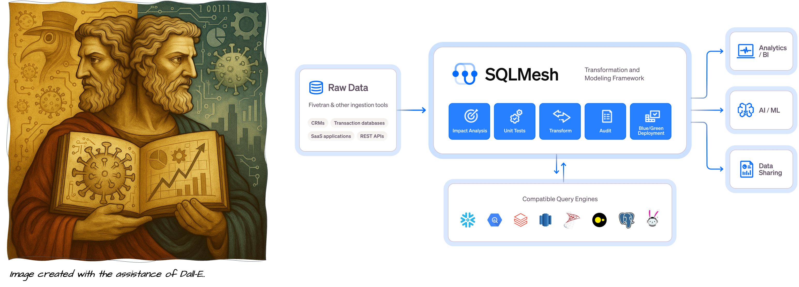
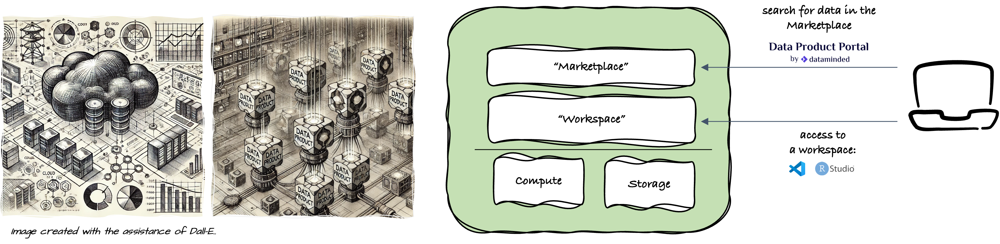
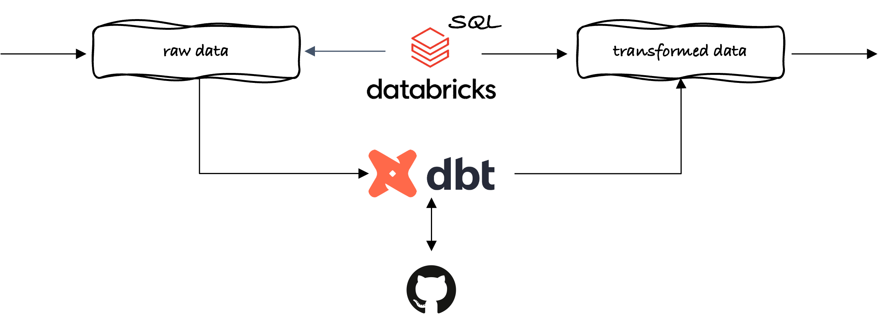

# Joeri R. Verbiest, PhD MSc

***Engineer - 20+ years across academia & industry - Turning complex research data into FAIR-T data.***

I obtained an MSc in Industrial Engineering (Ing.) from the De Nayer Institute in Belgium in 1999, followed by an MSc in Engineering Science (ir.) in 2002 and a PhD in Engineering Science in 2007, both from KU Leuven in Belgium. After completing my PhD, I moved into industry, working in the microwave, preclinical, and healthcare sectors. From 2017 onward, I systematically expanded my expertise in data analytics, data science, machine learning, and data engineering. In 2020, I returned to academia, applying my accumulated expertise in data.

Today, I work at Hasselt University, where I primarily focus on data and analytics engineering, delivering robust and scalable data solutions that accelerate scientific research. These solutions transform complex, heterogeneous research data into rigorously governed FAIR (Findable, Accessible, Interoperable, and Reusable) data, ensuring it is also Trustworthy (T). By embedding rich metadata, end-to-end provenance, and stringent quality controls, I enable reproducible analysis and decision-ready insights that researchers and stakeholders can trust.

[🌐 My website](https://jrverbiest.eu/)

## 🛠️ Work Experience @ Hasselt University

- **Data Engineer** @ [Data Science Institute (DSI)](https://www.uhasselt.be/en/instituten-en/dsi) - Since Feb 2025 - PI: Prof. dr. Niel Hens.

  - 🔨 The development of a data framework for pandemic preparedness, a framework that transforms contact survey data into analytics-ready data. The framework is built around [SQLMesh](https://sqlmesh.readthedocs.io/en/stable/).
  
   
  

  
  

   

- **Data Engineer** - @ [Research Group Biomedical Data Sciences](https://www.uhasselt.be/en/instituten-en/biomed-en/immunology/biomedical-data-sciences) - Since Sep 2023 - PI: Prof. dr. ir. Liesbet M. Peeters.
  
  - 🔬 [MS-Observe: real-world insights into ofatumumab treatment in Belgium (Research)](https://www.uhasselt.be/en/projects/detail/31240-project-r-16235). Responsible for data engineering, data management, and data quality assessment.
  - 🔨 Involved in the development of a data platform that enables the design of data products for data science research.
  
  

  
  

  - 🔨 Involved in Remote Clinical Monitoring Center [(RCMC)](https://www.researchportal.be/en/project/remote-clinical-monitoring-time-next-level)
  - ✍🏻 Contributed to PROSPeCD Study: Development of a Population Health Management Dashboard for Belgium - [Report](https://gbiomed.kuleuven.be/english/research/50000687/50000695/NL/afbeeldingen/research-images/copy_of_prospecd-report_final-report_081124.pdf)

---

## 🛠️ Past Work Experience

- **Engineer - Researcher - Technical Developer** @ [Research group Reval](https://www.uhasselt.be/nl/onderzoeksgroepen/reval), Faculty of Rehabilitation Sciences, Hasselt University, Belgium, part-time & fixed-term, Jan 2022 - Dec 2024.

  General (data) engineering support. Data and signal processing (time series), sensor data cleansing and data preparation for statistical analysis.
  
  As a researcher involved in the FWO-funded project, from dr. Lousin Moumdjian (PI: Prof. dr. Peter Feys): “*Auditory-motor coupling in persons with a cerebellar impairment.*”. Co-author of several scientific publications ([see publication list](https://github.com/JrVerbiest/jrverbiest.github.io?tab=readme-ov-file#-publications)).

- **Researcher** @ Karel de Grote University of Applied Science and Arts (KdG), Campus Hoboken, Antwerp, Belgium - part-time & fixed-term, Jan 2020 - Aug 2023.

  Research Projects:
  
  **[🌐 ML@E2dge](https://mlate2dge.github.io)** - 🔬PWO-project,  1 Dec 2021 -  31 Aug 2023 (14 person-month).

  Machine Learning at the Extreme Edge (ML@E2dge) examines applying machine learning to develop intelligent devices, ✍🏻 publication: [🌐 Gait Stride Length Estimation Using Embedded Machine Learning](https://www.mdpi.com/1424-8220/23/16/7166)

  🔨 Software & hardware tools used in this project are: Python, Pandas, NumPy, SciPy, TensorFlow, TensorFlow Lite, Keras, Weights & Biases (MLOps platform), Edge Impulse Development Studio, (Xsens) IMU sensor.

  **[🌐 Elgas](https://www.kdg.be/ELGAS)** - 🔬 TETRA-project, 1 Jan 2020 - 30 Nov 2021 (23 person-months).

  Effects of air quality in ships' accommodations on human health: monitoring environmental parameters, risk analysis, and recommendations. Project partners: Hogere Zeevaartschool (HZS), Karel De Grote Hogeschool (KdG) and Vlaamse Instelling voor Technologisch Onderzoek (VITO). KdG was responsible for the IoT platform (system integration, software, and firmware design). This research was funded by Flanders Innovation & Entrepreneurship (TETRA Fund).

  ✍🏻 Tutorial: [🌐 Cloud-Based Data Logger](https://tetra-elgas.github.io/Cloud_Based_Data_Logger/)

  🔨 Software & hardware tools used in this project are: Python, Raspberry Pi, and Teltonika RUT955 router.

- **Senior Consultant** at VeroTech, Leuven, Belgium - Full-time, Jan 2018 - Dec 2019.

  - **@ Cochlear Technology Centre (CTC)**, Mechelen, Belgium — System engineering support, PCB design/assembly/testing, and R&D in wireless power transfer. Tools: SIMetrix (Spice), Python, Altium Designer.

- **Project Manager** @ Peira Scientific Instruments, Turnhout, Belgium - Full-time, Aug 2017 - Dec 2017.

  Project ownership from start to finish — developing technical solutions, communicating with stakeholders, coordinating teams, and contributing to specifications, requirements, and documentation.

- **Senior Electronic Engineer** @ Bruker microCT & Bruker Biospin - Full-time, Feb 2016 - Jul 2017.

  - **@ Bruker Biospin** — Rheinstetten (DE) / Wissembourg (FR) / Kontich (BE) (Mar 2017 – Jul 2017): EPR application project involving sub-system electronic design with COTS high-power operational amplifiers, PCB design, and electronic simulation. Tools: Altium Designer, TINA & LTSpice.

  - **@ Bruker micro-CT** — Kontich, Belgium (Feb 2016 – Jul 2017):  Electrical/electronic design for optical X-ray imaging systems in the OMI team: architecture definition, system/sub-system requirements, integration/testing, supplier liaison, firmware for low-level control (e.g., stepper motor with encoder via COTS drivers), and PCB design. Tools: Altium Designer, TINA & LTSpice, Python.

- **Research Engineer** @ Pepric, Leuven, Belgium - Full-time, Mar 2012 - Jan 2016.

  Technology development of an ex-vivo tool for quantifying magnetic nanoparticles — architecture and system design, project definition/follow-up, supplier coordination, hardware/software integration, system testing/validation, and RF surface coil design (300 MHz). IP generation, patent (inventor): [*🌐 System and method for determining a quantity of magnetic particles*](https://data.epo.org/publication-server/rest/v1.0/publication-dates/20210707/patents/EP3256842NWB1/document.pdf). Contributed to technology roadmap, R&D planning/budgeting, and business plans. Member of EU FP7 [🌐 Multifun - Multifunctional nanotechnology for selective detection and treatment of cancer](https://cordis.europa.eu/project/id/262943). Co-author of several scientific publications ([see publication list](https://github.com/JrVerbiest/jrverbiest.github.io?tab=readme-ov-file#-publications)).

- **RF Engineer** @ Orban Microwave Products, Leuven, Belgium - Full-time, Aug 2009 - Mar 2012.

  Responsible for GaN power amplifier (using X-parameters and compact models) and active antenna design in the framework of European project 🔬 [*🌐 PANAMA (Power Amplifier aNd Antennas for mobile Applications)*](http://www.catrene.org/web/downloads/profiles_catrene/CA101-PANAMA-project%20profile-final%20%287-6-11%29.pdf) and involved in two work packages, one as work package leader.

  🔨 Tools: Advanced Design System, Momentum, Microwave office, EAGLE (PCB design), Vector Network Analyzer, spectrum analyser, power meter, signal generator and oscilloscope

- **Product Generation Engineer** @ NMDG, Bornem, Belgium - Full-time, Apr 2007 - Jul 2009.

  Prototype-to-product transition — supplier and test house contact person, project follow-up, procurement management, test/measurement support, and R&D on next-generation phase reference generator (IWT O&O project). Tools: Advanced Design System, Mathematica, VNA, waveform generators, power meter, oscilloscopes, spectrum analyser.

- **Project 🔬: Antenna design for medical implant** @ Client ‘X’ - Katholieke Universiteit Leuven (Esat-Telemic), a project under Non-Disclosure Agreement, Leuven, Belgium, Nov. 2006 - Mar 2007.

  Achievements: Proof of concept (TRL1) & prototype design (TRL2).

  🔨 Tools: CST Microwave Office, Matlab, and Advanced Design System

- **Doctoral Research** @ Katholieke Universiteit Leuven (Esat-Telemic), Leuven Belgium, Sep 2002 - Dec 2006.
  Design of antennas used on the human body. This research focused on the design of small, low-cost ultra-wideband (UWB) 3.0-9.0 GHz antennas for wireless body area networks (WBAN). Funded by IWT PhD scholarship (active participation in drafting and preparation of the grant application).

  Author of several scientific publications ([see publication list](https://github.com/JrVerbiest/jrverbiest.github.io?tab=readme-ov-file#-publications)).

  🔨 Tools: CST Microwave Office, Matlab, and Advanced Design System

  Other activities: treasurer IEEE Student Branch Leuven (2003–2005), supervised projects in Wireless and Mobile Communications course and multiple Master’s theses.

- **Summer job**, Clock-o-Matic, Holsbeek, Belgium, August 2001.

  Task: solves component failure by lightning (surge immunity) and a feasibility study of wireless communications inside a church (communication between electronic bell ringing systems).

---

## 🎓 Self-Education

### Data Analytics Engineering with dbt & Databricks SQL Warehouses

  

 
Enhance my skills in data analytics engineering, with a particular focus on dbt (data build tool) and Databricks SQL Warehouses. Design and implement modular, maintainable, and scalable data transformation pipelines that convert raw data into clean, reliable datasets, ready for analysis. Apply software engineering best practices—including version control, automated testing, and comprehensive documentation—to data workflows. Embrace data-as-a-product principles to deliver high-quality, consumer-centric data solutions that reliably meet the needs of downstream analytics and business users.

### Databricks

- Fundamentals of the Databricks Lakehouse Platform Certificate - [Certificate Of Completion](https://github.com/JrVerbiest/jrverbiest.github.io/blob/master/databricks/Fundamentals%20of%20the%20Databricks%20Lakehouse%20Platform%20Certificate.pdf)
- Databricks Fundamentals Accreditation - [Certificate Of Completion](https://github.com/JrVerbiest/jrverbiest.github.io/blob/master/databricks/Databricks%20Fundamentals%20Accreditation.pdf)

### Udacity

- DevOps Fluency - [Certificate Of Completion](https://github.com/JrVerbiest/Udacity-Projects/blob/main/certifications/DevOps%20Fluency.pdf)
- Data Stewardship Fluency - [Certificate Of Completion](https://github.com/JrVerbiest/Udacity-Projects/blob/main/certifications/Data%20Stewardship%20Fluency.pdf)
- Data Modeling Fluency - [Certificate Of Completion](https://github.com/JrVerbiest/Udacity-Projects/blob/main/certifications/Data%20Modeling%20Fluency.pdf)
- Practical Statistics Course - [Certificate Of Completion](https://graduation.udacity.com/confirm/e/3cc99f4c-eb24-11ed-b8bc-0719af86f51f)
- Machine Learning DevOps Engineer Nanodegree - [Certificate Of Completion](https://jrverbiest.eu/docs/Certificate%20Machine%20Learning%20DevOps%20Engineer.pdf)
- Machine Learning Engineer Nanodegree - [Certificate Of Completion](http://jrverbiest.eu/docs/Certificate%20Machine%20Learning%20Engineer%20Nanodegree.pdf)
- AI Programming with Python Nanodegree - [Certificate Of Completion](http://www.jrverbiest.eu/docs/Certificate%20AI%20Programming%20with%20Python%20Nanodegree.pdf)

The projects are listed on my [GitHub](https://github.com/JrVerbiest/Udacity-Projects).

## 🎓 Education

- **Doctoral degree in Engineering Science (PhD, dr.)**, Katholieke Universiteit Leuven, Leuven, Belgium, 2007.

  Funded by IWT PhD scholarship (active participation in drafting and preparation of the grant application)

  Thesis: Design of Antennas Used on the Human Body.

- **Master of Science in Engineering Science (MSc, ir.)**, Cum Laude, electrical engineering option Telecommunication and Telematic, Katholieke Universiteit Leuven, Leuven, Belgium, 2002

  Thesis: Exposure of Human Blood to an Electromagnetic Field and the numerical model.

  In the thesis, a numerical model (Finite-Difference Time-Domain method) was written in C on a Linux platform.

  Followed extra courses in:

  Biomedical engineering (Human Physiology, Biology and Biochemistry of Human Systems, including Human Biotechnology, Biomedical Measurements and Stimulation, and Transport Phenomena in Biological Systems).
  
  Energy engineering (Finite Elements for magnetic fields and optimisation).
  
- **Master of Science in Industrial Engineering (MSc, Ing.)**, Cum Laude, electricity option Electronics specialisation telecommunication, Institute for Higher Education in the Sciences & the arts, De Nayer Institute, Sint-Katelijne-Waver, Belgium, 1999

  Internship @ Hevrox EMC/Safety Services, Beringen, Belgium (today, Hevrox EMC/Safety Services is integrated into the EMI solution).

  Thesis: Validation of a fully anechoic room according to the prEN 50147-3 with HP-VEE. Content: Implementing an automatic measurement tool using HP-VEE and validating the fully anechoic chamber.

---

## ✍🏻 Publications

### Patent

- System and method for determining a quantity of magnetic particles. (**Inventor**) Pub. No.: [WO/2016/128353](https://data.epo.org/publication-server/rest/v1.0/publication-dates/20210707/patents/EP3256842NWB1/document.pdf), Filed: February 8, 2016 - Date of Patent: March 31, 2020  

### Journals

- Muhammad Bergas Nur Fayyad, **Joeri R. Verbiest**, Anna Ivanova, Mario Manto, Lousin Moumdjian, *"Feature derivation and classification of auditory-motor coupling dynamics in healthy and neurologically impaired adults."*, PLOS ONE, December 16, 2024. [**Paper**](https://journals.plos.org/plosone/article?id=10.1371/journal.pone.0315607) - cat. A1

- **Joeri R. Verbiest**, Bruno Bonnechère, Wim Saey, Patricia Van de Walle, Steven Truijen, Pieter Meyns, *"Gait Stride Length Estimation Using Embedded Machine Learning"*, MDPI Sensors, 2023. [**Paper**](https://www.mdpi.com/1424-8220/23/16/7166) - cat. A1

- Li X., Torfs G, Vandewege J, Bauwelinck J, **Verbiest J.R.**, "Sensitive and quantitative pEPR detection system for SPIO nanoparticles", Electronics Letters, pp. 1600-1601, Volume 49, Issue 25, 2013. [**Paper**](https://www.researchgate.net/publication/260616748_Sensitive_and_quantitative_pEPR_detection_system_for_SPIO_nanoparticles)

- **J.R. Verbiest** and G.A.E. Vandenbosch, "A low cost small size tapered slot antenna for lower band UWB applications", IEE Electronics Letters, Volume 42, Issue 12, pp. 670-671, 2006. [**Paper**](https://www.researchgate.net/publication/3388916_Low-cost_small-size_tapered_slot_antenna_for_lower_band_UWB_applications)

- **J.R. Verbiest** and G.A.E. Vandenbosch, "Small size planar triangular monopole antenna for UWB WBAN applications", IEE Electronics Letters, Volume 42, Issue 10, pp. 566-567, 2006. [**Paper**](https://www.researchgate.net/publication/3388880_Small-size_planar_triangular_monopole_antenna_for_UWB_WBAN_applications)

- **J.R. Verbiest** and G.A.E. Vandenbosch, "A Novel Small Size Printed Tapered Monopole Antenna for UWB WBAN", IEEE Antennas and Wireless Propagation Letters, pp. 377-379, vol. 5, 2006. [**Paper**](https://ieeexplore.ieee.org/document/1696014)

- **J.R. Verbiest** and G.A.E. Vandenbosch, "Microwave Breast Cancer Detection and Superficial Hyperthermia Breast Cancer Treatment", Revue HF, Belgian Journal of Electronics and Communication, no. 4, pp 35-44, 2004.

- **J.R. Verbiest** and G.A.E. Vandenbosch, "Antennas for Wireless Biomedical Applications", Revue HF, Belgian Journal of Electronics and Communication, no. 4, pp 13-24, 2004.

- **J.R. Verbiest** and G.A.E. Vandenbosch, "Development of Optimal Radiated Structures in the Surrounding of Biological Tissues", Revue HF, Belgian Journal of Electronics and Communication, no. 2, p. 18, 2004

### Conferences

- Sariga Kakkamani1, Frederic Jung, **Joeri Verbiest**, Liesbet Peeters, "RAG-Enhanced LLM Pipeline for Semantic Mapping of Context-based Features to OMOP Vocabulary.", OHDSI Symposium 2025, Hasselt, Belgium. [**Poster**](https://github.com/JrVerbiest/jrverbiest.github.io/blob/master/lit/102_RAG-LLM_Poster_Sariga%20Kakkamani%20-%20sariga%20k.pdf)

- Moumdjian, L. **Verbiest, J**., Moens, B., Rosso, M., Feys, P., "Dynamic adaptation responses to auditory perturbations during walking in progressive multiple sclerosis.", RIMS SIG mobility meeting, 4th Oct 2024, Aarhus.

- Detection of superparamagnetic iron oxide nanoparticles (SPION’s) in the pig lung using the particle electron paramagnetic resonance (pEPR) technique, Christine M Shortt, Deirdre Edge, Eric Roskin, **Joeri R Verbiest**, Farouk Markos, Stephanie Teughels, WMIC 2014, Seoul; Sept 17-20.

- Bio-distribution of supraparagmetic iron oxide nanoparticles in the pig, C. Shortt, D. Edge, S. Teughels, E. Roskin, **J. Verbiest**, O. Gobbo, A. Prina-Mello, Y. Volkov and F. Markos. Drug Discovery and Development, Pharmacology and Experimental Therapeutics, Experimental Biology 2014, San Diego; April 26-30.

- G. Pailloncy and **J. Verbiest**, "On the fly PA Design with the R&S NMDG ZVxPlus", ARMMS RF & Microwave Society, April 2009.

- **J.R. Verbiest** and G.A.E. Vandenbosch, "A Microstrip-Fed Equilateral Triangular Microstrip Antenna on a Finite Periodic Surface of Square Patches", The Second IASTED International Conference on Antennas, Radar, and Wave Propagation (ARP2005), Banff, Canada, pp.366-370, 19-21 July 2005.

- **J.R. Verbiest** and G.A.E. Vandenbosch, "Design of very small antennas for biomedical devices", Proc. 12th URSI Forum, Brussels, Belgium, 10 December 2004.

- **J.R. Verbiest**, P. Delmotte, G.A.E. Vandenbosch, L. Verschaeve and A. Maes, "The Use of High Impedance Surfaces in the Construction of an Exposure Setup. A Preliminary Feasibility Study", Journées Internationales de Nice sur les Antennes (JINA2004), Nice, France, pp. 116-117, 8-10 November 2004.

- **J.R. Verbiest**, G.A.E. Vandenbosch, "Development of Optimal Radiated Structures in the Surrounding of Biological Tissues", Proc. 11th URSI Forum, Brussels, Belgium, 18 December 2003.

- **J.R. Verbiest** and G.A.E. Vandenbosch, "Development of a Finite-Difference Time-Domain model for the research on biological effects by electromagnetic fields", Proc. 10th URSI Forum, Brussels, Belgium, 13 December 2002.

### Preprints

- Marie Van de Putte, Laura Christiaens, Laura Goetschalckx, Stefan Morreel, **Joeri R. Verbiest**, Mare Claeys, Josefien Van Olmen, Bert Vaes, Liesbet M. Peeters, *"Developing a Population Health Management Dashboard for Belgium: a focus group study with mock-up design."*, medRxiv preprint, April 2025. [**Paper**](https://www.medrxiv.org/content/10.1101/2025.04.25.25326410v1)

### Zenodo Records

- Marie Van de Putte, Laura Christiaens, Laura Goetschalckx, Stefan Morreel, **Joeri R. Verbiest**, Mare Claeys, Josefien Van Olmend, Bert Vaes, Liesbet M. Peeters, Pilot Research on the Requirements of Potential Users for a Population Health Management Dashboard, EQuiP 2025. [Pilot Research on the Requirements of Potential Users for a Population Health Management Dashboard](https://zenodo.org/records/15165445).

---
***Last update: 3 Jan. 2025***
